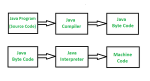

# Introduction

This note explains how a program works and introduce concepts such as programming languages, compiler and interpreter.

## How a Program Works

A computer can be simplified as the following diagram:

### CPU

CPU is designed to perform simple operations on pieces of data: examples include reading data, adding, subtracting, multiplying, and dividing numbers.

It understands instructions written in machine language, also called machine code. Each brand of CPU has its own instruction set.

To carry out meaningful calculation, CPU must perform many machine-levle (low-level) operations in 0s and 1s (binary code).

### Program Execution

Program must be copied from secondary memory (hard disk or SSD) to RAM each time CPU executes it. CPU executes program in cycle:

- Fetch: read the next instruction from memory into CPU
- Decode: CPU decodes fetched instruction to determine which operation to perform
- Execute: perform the operation

## Programming Languages

Machine languages are impractical for people to write and understand. Computer scientists invented assembly languages that use short words (mnemonics) for instructions instead of binary numbers.

Nonetheless, computers can only understand and execute machine languages. Therefore there is a so-called **Assembler** to translate a assembly language to a machine language for execution by CPU.

However, assembly languages are close in nature to machine language. Both machine languages and assembly languages are low-level languages because they have low-level relatively simple instructions.

High-Level languages invented to allow simple creation of powerful and complex programs. There is no need to know how CPU works or write large number of instructions. They are more intuitive to understand.

As you can see, programs written in high-level languages must be translated into machine language to be executed.

## Constructs of a Programming Language

- Keywords: predefined words used to write program in high-level language.
  - Each keyword has specific meaning. For example: `if`, `true`.
- Operators: perform operations on data.
  - Example: math operators `+` and `-` to perform arithmetic.
- Syntax: set of rules to be followed when writing program.
- Expression: a single value such as `3` or an operation such as `3 + 5` that produce a value.
- Statement: individual instruction that use expression(s) to perform a task. For example: `print(3 + 5)`.
- Source code: statements written by programmer.
- Syntax error: errors that prevent code from being translated into machine code.

## Compiler and Interpreter

A compiler translates high-level language programs into machine language programs. Machine language programs are executable applications that can be executed by computers. Diffeernt comuputers (cell phone, PC, mainframe cmputer) may use different CPUs that execute different machine languages. It is the job of the compiler to compile the high level program into different machine code programs for different computers.

There is another way to run programs written in high-level langauges: using interpreter. An interpreter is a "machine" that translates and executes instructions in high-level language program such as Python. It interprets and executes one instrunction at a time.

Of course, the interpreter is a machine code program executed in a CPU. You can think an interpreter as a **machine emulator** or **software machine** that can understand and execute high-level langugase instructions.

Python is an interpreter and Python programs are interprted (executed) by Python. A program language that requires an interpreter is often called a scripting langauge. A program written in scripting language is called a script.

The key differences between a compiler and an interpreter are:

- all vs one statement a step: a compiler compiles all instructions together. An interpreter interprets one instruction/statement at one time.
- executable files or not: A compiler produces excutable machine code files from source code files. An interpreter doesn't produce any executable files from source code file.
- where to run: for a compiler, a user runs the executable file (program/application) in a computer or a virtual machine. An intepreters interpretes and executes a statement at a time directly from source code.

However, the boundary between a compiler and an interpreter is not clear because there are compilers such as [Cython](https://cython.org/) that compiles Python source code to machine code. Another reason is that high-level languages such as Java or C# use a virtual machine to run their code. A virtual machine is similar to an interpreter. The virtual machine code is usually called **byte code** where the real machine code is called **machine code**. The **byte code** is an **intermediate representation (IR)** because it still needs to be converted into machine code by the virtual machine. You may think the Java Virtual Machine (JVM) as an interpreter as depicted in the following diagram.

## Reading
We will do a quick read of a fundamental facet of programming: language and thought.
This relates to a very interesting review of variations in human language conceptualization and processing by reviewing the Australian aboriginal language Guugu Yimithirr!

Here is the excerpt:    [Language Shaping](./readings/language_shapes.pdf)
                        [Language Shaping](./readings/language_shapes.md)

(source: [geeksforgeeks.org: Difference between Byte Code and Machine Code](https://www.geeksforgeeks.org/difference-between-byte-code-and-machine-code/))
